The goal of this project is to evaluate the performance of a multiclass machine learning model trained using the baseline BERT model (2018) compared against the advanced Modern BERT model (2025) on the task of classifying sentences as either Situation, Task, Action, or Response in the context of a interview. 

- [What is STAR?](#what-is-star)
- [Why not use LLMs?](#why-not-use-llms)
- [What is it Trained on?](#what-is-it-trained-on)
- [What is Modern Bert](#what-is-modern-bert)
- [Why use this for our project?](#why-use-this-for-our-project)
- [Conclusion](#conclusion)
- [Usage](#Usage)
- [References](#References)

# What is STAR?
The STAR method is a structured interview technique where job candidates answer behavioral questions by describing a specific **Situation**, **Task**, **Action**, and **Result** to demonstrate their skills and problem-solving abilities. [Read More](https://www.uxdesigninstitute.com/blog/what-is-the-star-method/)
# Why not use LLMs?
LLMs have shown good results in text classification tasks, but they present unique challenges compared to supervised learning approaches. When comparing LLMs to each other and to BERT-based models for supervised learning, several factors emerge.
## Performance and Data Requirements
LLMs, like Llama3 and GPT-4, can outperform other methods in complex classification tasks, such as multiclass classification [1](https://arxiv.org/html/2501.08457v1). However, their performance can be more subjective and less consistent than those models, making quantification and direct comparison challenging. BERT-based models, on the other hand, perform well with large amounts of labeled data. In scenarios with limited data, alternative approaches like fine-tuning and transfer learning with a *single-classification head* (one label prediction) offer significant advantages[ 7](https://www.striveworks.com/blog/text-classification-with-llms-a-roundup-of-the-best-methods).
## Consistency and Interpretability
Models like decision trees or linear models offer more interpretable results, such as feature importance and decision paths. LLMs, with their complex neural networks, are less straightforward to interpret  [1](https://arxiv.org/html/2501.08457v1).
## Latency and Deployment
LLMs like ChatGPT are typically not deployed as low-latency APIs, making them less suitable for real-time applications where response time is critical. Local models often perform better for classifying text in terms of speed and efficiency [1](https://arxiv.org/html/2501.08457v1).
## Conclusion
While LLMs show promise in complex classification tasks, their use presents challenges in testing, consistency, and deployment. BERT-based models and transfer learning approaches offer competitive performance, especially in scenarios with limited data   
# What is it Trained on? 
## Exploratory Data Analysis (EDA)
### Basic Information
Showing `319` examples in both categories, no missing values. 
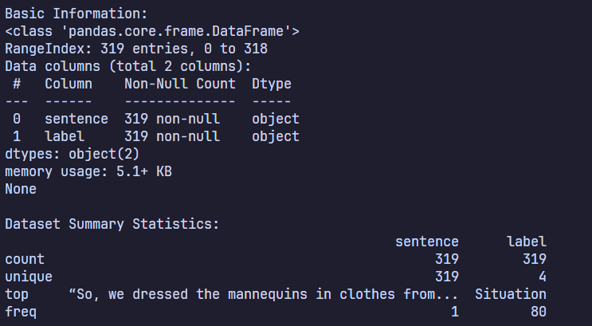
### DataFrame
The graph shows the distribution of labels and their count. Every category of sentence has 80 examples except Action having 79 examples. 
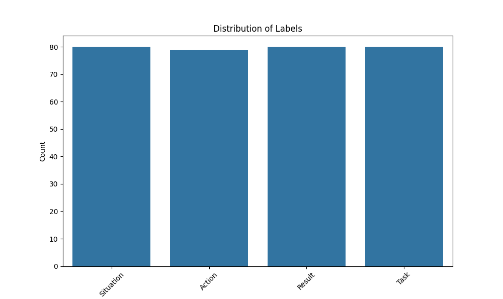
## Sentence Length. 
The average talking time in 1 minute is **125-250 words**.
Assuming the user talks for around **3-5 minutes** per response.
### STAR method frequency 
The star respond frame-work specifies that some labels should be longer than others. 
For example:
	1. Situation = 15% of the response. 
	2. Task = 10% of speaking time. 
	3. Action = 60% of speaking time. 
	4. Result = 15% of the time. 
Embedding this information would not be beneficial. Consider a situation where the user explains the *Situation* or setup for a problem and quickly saying "*I solved it*" for the *Action*. The ideal performance of our model would be that the user achieved all parts of *STAR* response. However, in this situation the model might incorrectly classify the *Situation* as *Action* as a result of the length. By splitting the classification up into sentences. This gives both the *user and model* a clear frame work for making sure the user has at least one element of the *STAR response*, we can later comment on the number of sentences classified to determine the mentions to the speaking time. 
#### For 3 Minutes of Speaking time (750 Words):
- **S (Situation, 15% of speaking time)**: $` 750 \times 0.15 = 112.5 \text{ words} `$
- **T (Task, 10% of speaking time)**: $` 750 \times 0.10 = 75 \text{ words} `$
- **A (Action, 60 % of speaking time)**: $`  750 \times 0.60 = 450 \text{ words} `$
- **R (Result, 15% of speaking time)**: $` 750 \times 0.15 = 112.5 \text{ words} `$
### Average Sentence Length
#### For 3 Minutes (750 Words total):
 - **S (Situation)**:
	 - With an estimate of 4 sentences, Sentences: $` 112.5 \div 4 \approx \text{28 words per sentence} `$
- **T (Task)**:
	- With an estimate of 3 sentences, Words: ~75 $` 75 \div 3 \approx \text{25 words per sentence} `$
- **A (Action)**:
	- With an estimate of 10 sentences, Words: ~450 $` 450 \div 10 \approx \text{45 words per sentence} `$
- **R (Result)**:
	- With an estimate of 4 sentences $` 112.5 \div 4 \approx \text{28 words per sentence} `$
### Actual Average Sentence Length for our data 
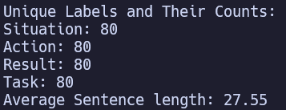

For technical documents or detailed explanations, 27.55 words per sentence works well as it allows for detailed, precise communication. For casual or conversational writing [2](https://insidegovuk.blog.gov.uk/2014/08/04/sentence-length-why-25-words-is-our-limit/), this may feel too dense, requiring adjustments toward shorter sentences.
The Following Figure shows the distribution of sentence lengths. 
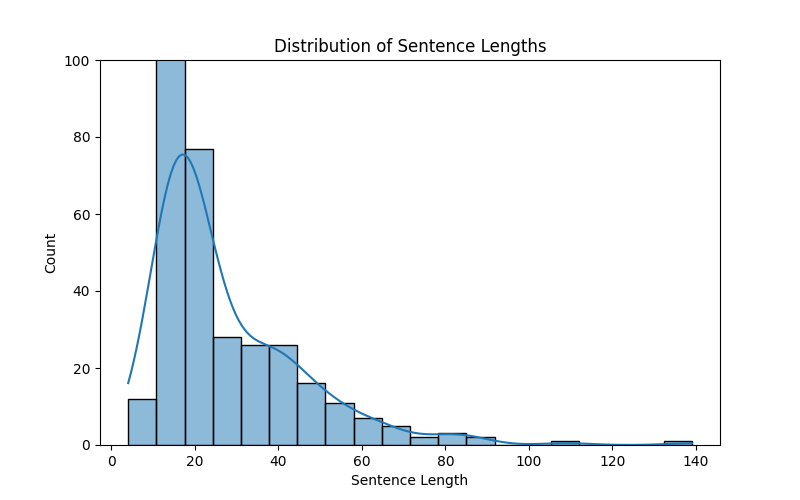
The following figure splits this up by label. 
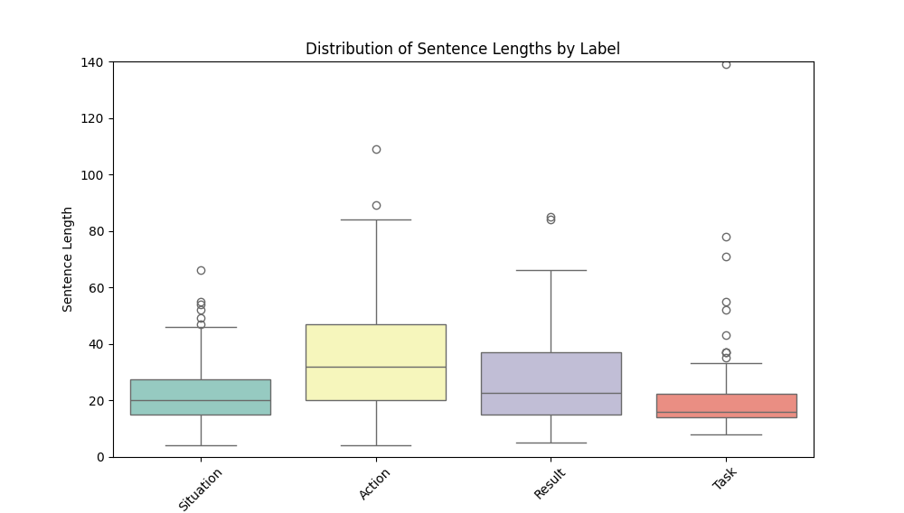
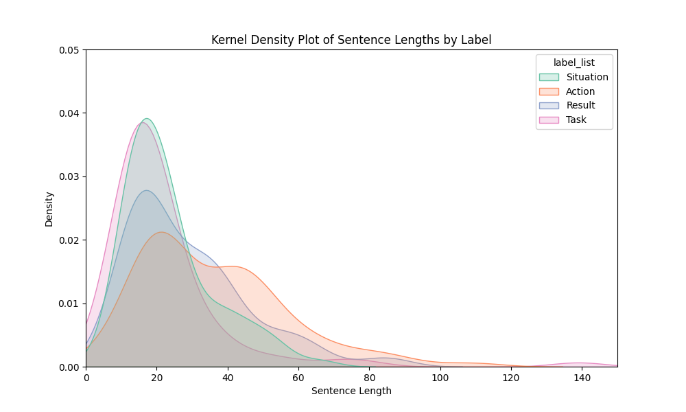
### Fixes 
We are going to remove some of the outliers for **all labels excluding Action** as they likely skew the data for one of the smaller parts of the response. I will use a common value of marking a Z score of more than -3 or 3 Standard Deviations away from the mean being outliers. I will discard those from the data sets to get the average sentence length down. 
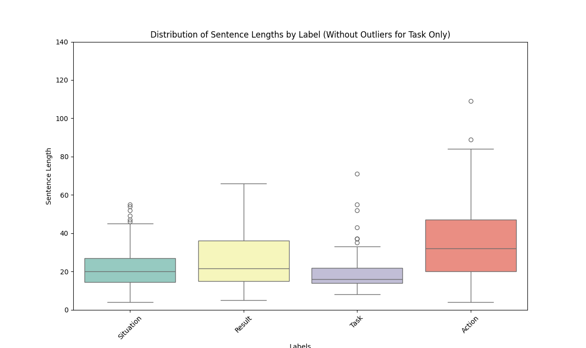
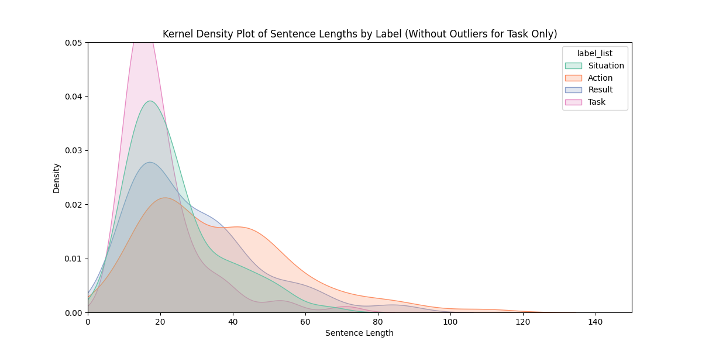
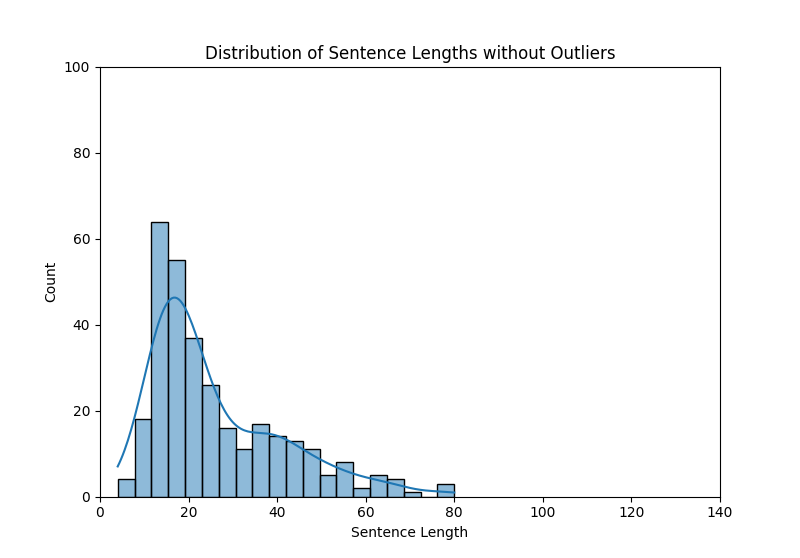
- Our data might not look that much different, and that is because we've only removed 5 pieces of data.
- 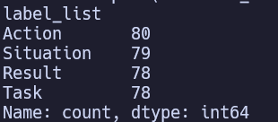
- The new average sentence length is now $` \approx 26.55 `$
- 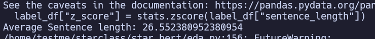

While I could continue to lower the average more this would likely cause me two have to attack some of the longer sentences in the `Action` column. Not only were those examples hard to find, I don't want to restrict the amount of data our model has to be trained on otherwise it won't preform the task we want reliably.   
# What Is Loss?
Loss is a measure of how wrong your model's predictions are compared to the correct answers. For a model like BERT, loss tells it how well it’s learning to understand and analyze text.
High loss means the model's predictions are far from correct.
Low loss means the model is doing a good job.
### How Does Loss Work for BERT?
1. BERT takes input text (e.g., sentences).
2. It predicts something based on its task (e.g., classify a sentence or predict masked words).
3. Loss is calculated by comparing BERT’s prediction to the correct answer:
    - If the prediction is close, the loss is small.
    - If it’s way off, the loss is large.
### Methods for Lowering Loss
Already done is **removing outliers** which focuses the model on learning from typical data which makes loss smaller and more stable. This helps the model train faster and generalize better to unseen data.
#### Data Preprocessing
 *Remove stopwords/puncuations* - words like `uhh` `umm` or even `the` `in`.  These words might cause *noise* which could distort the model and lead to inaccurate conclusions. The process of *Text Normalization* which also involves correct spelling and removing extra spaces and characters would be useful
 Luckily the previous students left us with some legacy code for the API *AssemblyAI*. The following code preprocesses the text for special characters, numbers, symbols and replaces them with spaces. The stopword removal function takes a pre-made list of `stopwords.words` and replaces them with spaces. 
 ```python
 # convert to lowercase, strip and remove punctuations
def _preprocess(text):
    text = text.lower()
    text = text.strip()
    text = re.compile("<.*?>").sub("", text)
    text = re.compile("[%s]" % re.escape(string.punctuation)).sub(" ", text)
    text = re.sub("\s+", " ", text)
    text = re.sub(r"\[[0-9]*\]", " ", text)
    text = re.sub(r"[^\w\s]", "", str(text).lower().strip())
    text = re.sub(r"\d", " ", text)
    text = re.sub(r"\s+", " ", text)
    return text
# STOPWORD REMOVAL
def _stopword(string):
    a = [
        i
        for i in string.split()
        if i not in stopwords.words("english") and i not in ["uhh", "umm", "uhm"]
    ]
    return " ".join(a)
```
#### Training
Most of the other methods of lowering the *Loss* come with Training including

1. *Hyperparameter Tuning*
	- Learning Rate optimization
	- Batch Size optimization
2. *Tokenization*
	- Often done for us by the `AutoTokenizer` from HuggingFace 
3. *Early Stopping*
	- Stop when loss stops improving. 

# What is BERT?
- BERT (Bidirectional Encoder Representations from Transformers) is a pre-trained deep learning model developed by Google.
- Features
	1. **Bidirectional Contextual Understanding**:
		- BERT processes text bidirectionally, meaning it takes into account both the left and right contexts of a word in a sentence simultaneously.
    - **Masked Language Modeling (MLM)**: Predicting missing words in a sentence.
	    - Transformer Architecture enables BERT to process the input in whole rather than sequentially like other neural networks would. 
- This as well as being trained on large scale data sets the Wikipedia enable the model to generalize over smaller data sets. 
- BERT embeds contextual information between words in sentences automating the goal of labeling the sentence based on the context. 
## Evaluation Metrics for BERT
### Classification Report 
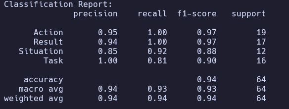
### Precision
- Measures how many of our *predicted positives* were *true positives*
- High precision means a low rate of false positives. 
- *Example*: For "Action" class, precision of 0.95 means that when the model predicts something is an "Action", it's correct 95% of the time on the test set of data. 
### Recall
- Measures how many *true positives* were found in total. 
- Precision is $` \text{True positives} / \text{(True Positives + False Positives)} `$
- While *Recall is* $` \text{True Positives} / \text{(True Positives + False Negatives)} `$
- *Example*: For "Action" class, recall of 1.00 means it found 100% of all actual Action instances. 
### F1-Score
- Harmonic mean of precision and recall
- $` 2*\text{Percision * Recall} / (Precision + Recall) `$
- *Example:* Action's F1 of 0.97 indicates strong balance between precision and recall.
- Brings both Recall and Precision into a single score. Is often used for quick comparison. 
### Confusion Matrix 
The *Confusion Matrix* summarizes the predictions by showing the counts of true positives (correctly predicted positives), true negatives (correctly predicted negatives), false positives (incorrectly predicted positives), and false negatives (incorrectly predicted negatives). For example in the following figure, the *Task* label was incorrectly classified as *Action* once and as *Situation* 2 times and correctly classified 13 times. This example is before we took our *outliers* out of the data.
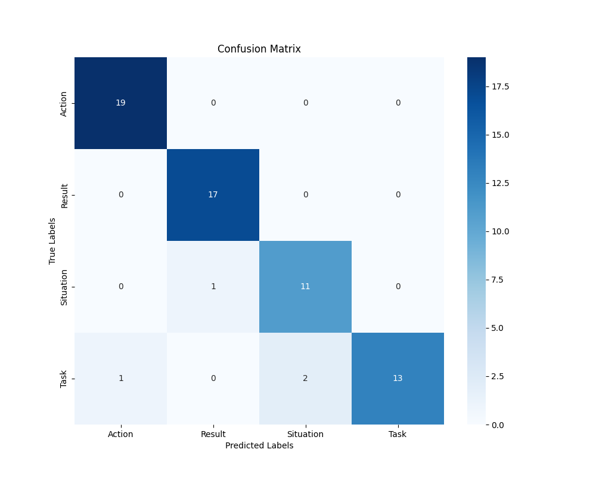
The second figure shows the after *outliers* were taken out of the data
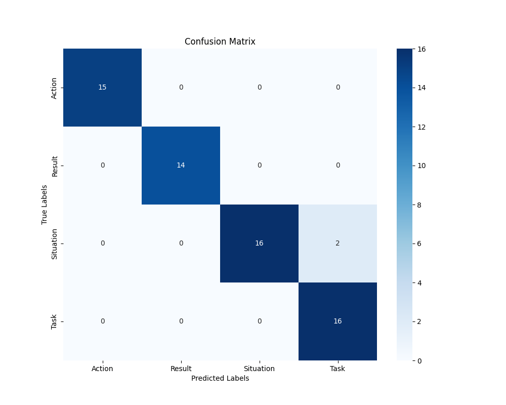
Still Some false positives for *Situation*, however each label is a lot more even now. 
### Experimental Setup
- **Preprocessing**:
	- **Label Encoder** is used to convert labels (STAR) into numbers that the model can understand. 
	- Data is split using `train_test_split` from `scikit-learn` with a testing size of 0.2 (20% of data test, 80% training)
	- `Bert Tokenizer` tokenizes the data into stuff Bert can understand. Converting each sentence to a fixed length of 128
	- **Pre-trained BERT Model**: The BERT model (`BertForSequenceClassification`) is initialized with weights pre-trained on large text corpora. The model architecture is designed for sequence classification tasks (e.g., sentiment analysis, topic classification).
- **Training and Fine-Tuning**: 
	- Tests indicate *Learning Rate around higher around 3e-5 to 5e-5* seems to be the best. *Larger batch sizes lower score heavily.* *Larger epochs also lower score heavily.* 
### Hyper-params
The script for testing hyper params is `tuning.py`, various loss functions and hyper parameters are tried and aggregated into `tuning_results.json` . 
The type of results I'm looking for are a high `eval_accuracy` and a low `eval_loss` and low `training_loss`. 
The difference between the `eval_loss` is the loss of the model on *unseen data* while `training_loss` is the loss on the *training data*. 
	For example, if the `training_loss` continued to go down to `0.1` while the `eval_loss` stayed at `0.3` then we would say that the model is learning well from the training data but this isn't helping the model generate better classifications from unseen data. 
The following shows the parameters with the best metrics. 
```json
{
    "parameters": {
      "learning_rate": 5e-05,
      "batch_size": 16,
      "num_train_epochs": 5,
      "max_length": 128
    },
    "loss_function": "cross_entropy",
    "eval_results": {
      "eval_loss": 0.32768139243125916,
      "eval_accuracy": 0.9682539682539683,
      "eval_precision": 0.969187675070028,
      "eval_recall": 0.9682539682539683,
      "eval_f1": 0.9682207958070027,
      "eval_runtime": 0.2065,
      "eval_samples_per_second": 305.04,
      "eval_steps_per_second": 19.368,
      "epoch": 5.0
    },
    "training_loss": 0.6607767403125763,
    "output_dir": "./tuning_results/run_20250120_182703"
  },
```
# What is ModernBERT?
The above post explains how Modern Bert works but is, "available as a _slot-in_ replacement for any BERT-like models, with both a **base** (149M params) and **large** (395M params) model size." [5](https://huggingface.co/blog/modernbert) 
The majority of improvements are going to come in performance. Modern BERT takes advantage of libraries like `flash-attn` which can speed up training and response. Other improvements like more input tokens (8192 v BERT's limited 512) will be useful for longer responses, we would have to cap responses otherwise.  
# Why use this for our project?
I believe that the speed of Modern BERT and accuracy of both of the models makes them well suited for our task. Using [Hugging Face Serverless API](https://huggingface.co/docs/api-inference/index) we can host and run our model and use up to `1000 requests` for the free tier. Assuming `1 response` is one request this can handle not only small scale sites and testing but can also be scaled up with a Custom API end point on a variety of servers like *AWS*, *Azure*, *Google Cloud*.  `AWS Lambda` has a free tier allows for easy server-less computing which should cover more than enough requests for us to use every month that they reset. I think this would make more sense then looking for answers in ChatGPT prompting. The reliability of this model and its high accuracy make it more testable scalable than a large language model solution. Integrating it into our development should be easy while there might be some work in setup for AWS lambda later on. 
# Conclusion
I will use ModernBERT as a drop in replacement for BERT in order to deal with longer responses. 
# Usage
## UV
I would recommend using `uv` to manage and package dependencies. UV handles creating a virtual environment, package management, syncing, and adding packages that we need. 
**Read the README.md for each model** 
### [Install UV <<<<<<<](https://docs.astral.sh/uv/getting-started/installation/)

#### Linux & Mac:
`curl -LsSf https://astral.sh/uv/install.sh | sh`
`wget -qO- https://astral.sh/uv/install.sh | sh`
#### Windows:
`powershell -ExecutionPolicy ByPass -c "irm https://astral.sh/uv/install.ps1 | iex"`
## Hugging Face
Test them using `pipeline.py`
1. [starclass_bert](https://huggingface.co/dnttestmee/starclass_bert)
2. [starclass_modernbert](https://huggingface.co/dnttestmee/starclass_modernbert)
# References
1 - https://arxiv.org/html/2501.08457v1
2 - https://insidegovuk.blog.gov.uk/2014/08/04/sentence-length-why-25-words-is-our-limit/
7 -  https://www.striveworks.com/blog/text-classification-with-llms-a-roundup-of-the-best-methods
```
# Credits modernBERT 
@misc{modernbert,
      title={Smarter, Better, Faster, Longer: A Modern Bidirectional Encoder for Fast, Memory Efficient, and Long Context Finetuning and Inference}, 
      author={Benjamin Warner and Antoine Chaffin and Benjamin Clavié and Orion Weller and Oskar Hallström and Said Taghadouini and Alexis Gallagher and Raja Biswas and Faisal Ladhak and Tom Aarsen and Nathan Cooper and Griffin Adams and Jeremy Howard and Iacopo Poli},
      year={2024},
      eprint={2412.13663},
      archivePrefix={arXiv},
      primaryClass={cs.CL},
      url={https://arxiv.org/abs/2412.13663}, 
}
```
